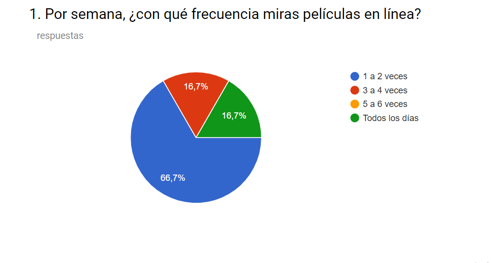
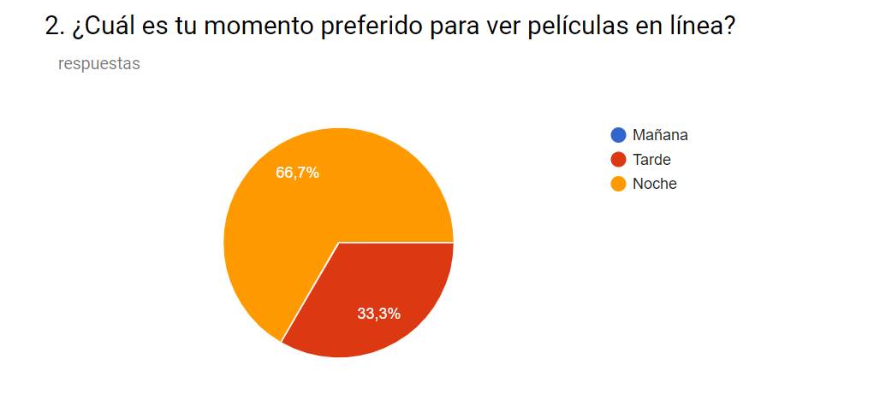
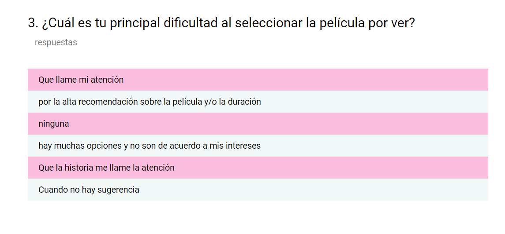
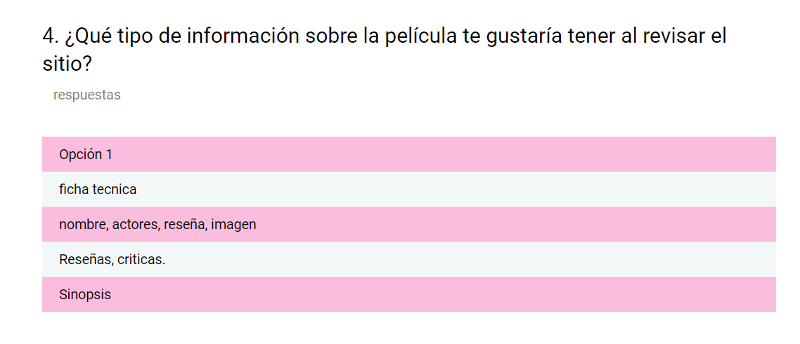
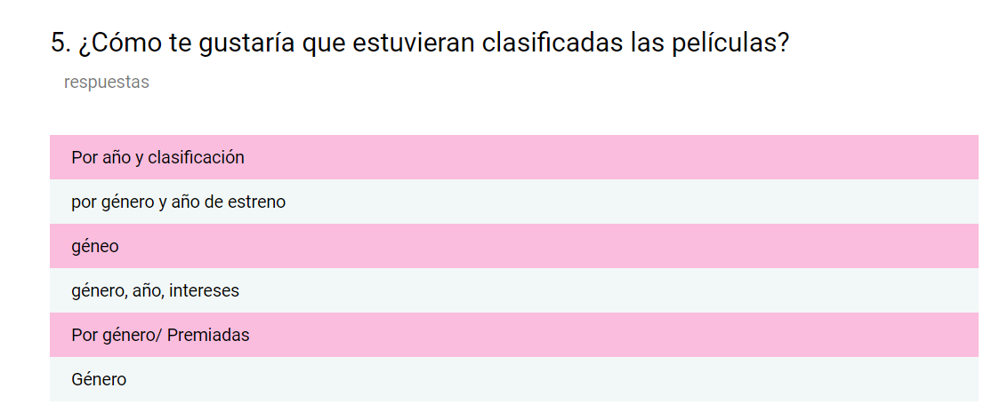

# MoodVie

## Índice

- [Descripción](#definición_del_producto)
- [Diseño de la experiencia de usuario](#primera_interación)
- [Instrucciones para usuarios](#instrucciones_para_usuarios)
- [Información para desarrolladores](#información_para_desarrolladores)
- [Autoras y agradecimientos](#autoras)


## Definición del producto

¡Una película para cada estado de ánimo!

Somos una Web App de recomendación de películas.
En Moods&Movies nos encargamos de que tu selección de películas sea fácil y rápida, con nuestras sugerencias de películas con base a tu estado de ánimo. Te            recomendamos películas de forma aleatoria, por lo que cada que vez que nos         visites, recibirás recomendaciones distintas. 

## Primera iteración

En nuestro primer sprint decidimos crear una Web App para jóvenes-adultos (personas de 25 a 40 años), que al terminar su jornada de trabajo desean ver una película en la comodidad de su casa y no quieren demorarse mucho en la selección de la película. Por lo tanto ideamos un producto que mostrara las películas mejor rankeadas por Rotten Tomatoes y también ofrecer a nuestros usuarios la opción de obtener sugerencias de películas con base a su estado de ánimo.

Con base a nuestras encuestas descubrimos que en general nuestro usuario.
- Visualiza películas en línea de 1 a 2 veces entre semana.
- Visualiza las películas por la noche.
-  Es difícil su elección por falta de interés en la trama o no tiene recomendaciones personalizadas.
- Le interesa saber la sinopsis y las críticas de las películas.
- Les gusta que la clasificación sea con base al género de la película.
- Le interesa que el sitio sea de fácil acceso, intuitiva y que tenga un buscador por película.








Los principales problemas que deseábamos solucionar fueron:

- Saber las críticas de las películas.
- Tener recomendaciones personalizadas.

Por lo que nuestras historias de usuario fueron:

- Yo como usuario quiero consultar una página de recomendaciones de las películas mejor rankeadas por Rotten Tomatoes.

- Yo como usuario quiero poder recibir recomendaciones de películas con base a mi estado de ánimo para elegir más rápido

El primer nombre que le pusimos a nuestro producto fue Películas Entomatadas y los prototipos de baja y alta fidelidad son los siguientes respectivamente.

https://marvelapp.com/1d93ch46/screen/53875820
https://marvelapp.com/4cbb823


Con el primer prototipo de alta fidelidad hicimos las pruebas de usuario, con 6 usuarios de entre 25 a 35 años (5 mujeres y 2 hombres) obteniendo lo siguiente:


## Segunda iteración

Con base a las pruebas de usuario tuvimos que hacer modificaciones tanto al concepto como al contenido. Teniendo como resultado Moods&Movies.

Donde nuestro principal objetivo es ofrecer sugerencias a nuestros usuarios con base a su estado de ánimo., ya que les pareció útil que las sugerencias fuesen de esa forma; y la mayoría de nuestros testeados no les servía de referencia la clasificación según Rotten Tomatoes.

Por lo que nuestro nuevo producto quedó de la siguiente forma:


https://marvelapp.com/43d458a


# Instrucciones para usuarios
1. Ingresa a la página [MoodVie](https://karenamicone.github.io/Peliculas-entomatadas/src/)

2. Haz click en el botón que coincida con tu estado de ánimo :bowtie: . Te recomendaremos dos películas de acuerdo con tu *mood*.

3. En cada tarjeta de las películas recomendadas :movie_camera: podrás consultar el título, año, duración de la película, director, reparto y sinopsis. 

4. Para leer la sinopsis da click al ícono de tres puntitos verticales que se encuentra en la esquina superior derecha de la tarjeta de información, debajo del poster de la película.

5. Si las recomendaciones no te apetencen, da click al botón de regresar :arrow_left: y vuelve a consultar. 

6. También contamos con un buscador para que puedas consultar la sinopsis de las películas por título :vhs: . 


# Información para desarrolladores

## Consideraciones técnicas

El proyecto está implementado en JavaScript [vanilla](https://medium.com/laboratoria-how-to/vanillajs-vs-jquery-31e623bbd46e) (ES6), HTML 5, CSS 3 y Materialize.


El _boilerplate_ contiene una estructura de archivos como punto de partida así
como toda la configuración de dependencias:

```text
.
├── package-lock.json
├── README.md
├── src
   ├── assets
   │   ├── images
   │   │
   ├── data.js
   ├── index.html
   ├── main.js
   └── style.css
```
## Herramientas

- [Git](https://git-scm.com/)
- [GitHub](https://github.com/)
- [GitHub Pages](https://pages.github.com/)
- [Node.js](https://nodejs.org/)

# Instrucciones

## Obtener una copia local del repositorio
1. Hacer un 🍴 fork de este repositorio: <https://github.com/KarenAmicone/Peliculas-entomatadas>

2. Clonar el fork en tu computadora (copia local).


## Instalar las dependencias

1. Instala las dependencias del proyecto con el comando `npm install`. Esto
   asume que has instalado [Node.js](https://nodejs.org/) (que incluye [npm](https://docs.npmjs.com/)).

## Funcionalidad de la página y consideraciones

MoodVie utiliza la API de OMDb (The Open Movie Database), por medio de `fetch()`.
La función de la página es pintar dos recomendaciones de películas extraídas por título de la base de datos de OMDb, con base en el estado de ánimo de las personas. Esto se hace de forma aleatoria con un sencillo algoritmo que utiliza el método `Math.random`.

## Autoras

* Brenda Vasquez <https://github.com/Brendss>
* Adriana Acosta <https://github.com/AdrianaPi>
* Diana Muñoz <https://github.com/DianaLiz11>
* Karen Amicone <https://github.com/KarenAmicone>

## Agradecimientos
Gracias a Laboratoria por los conocimientos compartidos y a OMDb por crear una API de uso libre. 


---


